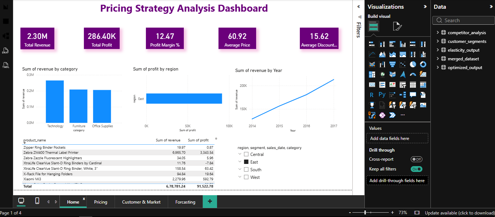
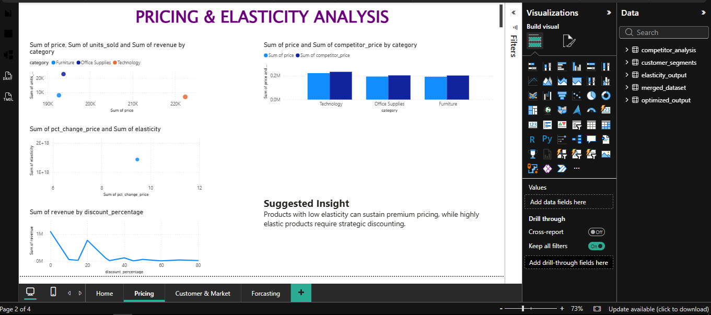
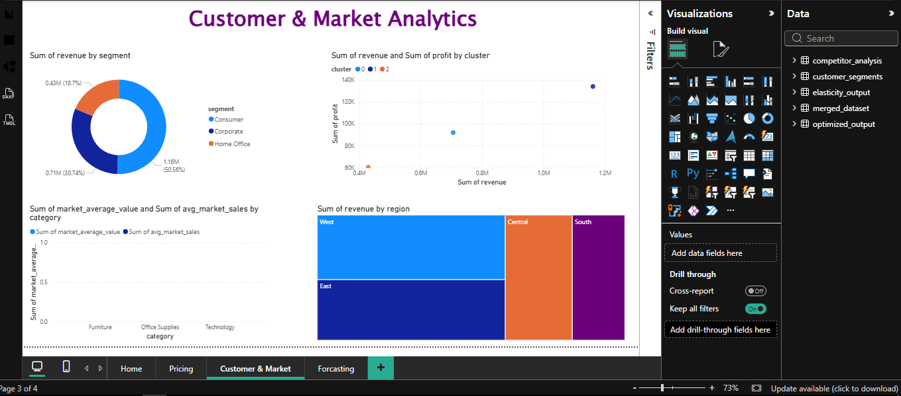
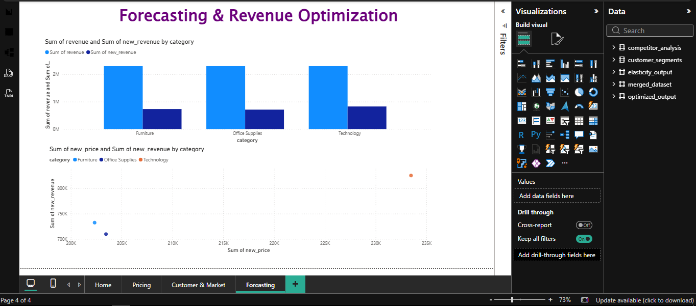

# Pricing Strategy Analysis 📈

*Data‑driven pricing & revenue optimization pipeline*  

A **complete end‑to‑end analytics solution** that cleans raw retail data, merges multiple sources, computes price elasticity, simulates optimal price changes, analyzes competitors, segments customers, forecasts sales, and persists results to a SQL Server database.

---

## 🔥 Why This Project Stands Out

- **Full‑stack data workflow** (ingestion → transformation → analytics → storage)  
- **Business impact:** Identifies revenue‑lifting price adjustments and forecasts demand trends.  
- **Scalable & reproducible:** Modular Python package (`src/`) with clear separation of concerns.  
- **Ready for production:** SQL Server upload, CSV export, and a CLI‑style `main.py` driver.  

*Ideal for roles in Data Engineering, Pricing Analytics, Business Intelligence, or any data‑science‑focused position.*

---

## 🗂️ Repository Structure

```text
pricing-strategy-analysis/
├── data/
│   ├── merged/
│   │   └── merged_dataset.csv
│   ├── processed/
│   │   ├── competitor_analysis.csv
│   │   ├── customer_segments.csv
│   │   ├── elasticity_output.csv
│   │   ├── merged_dataset.csv
│   │   └── optimized_output.csv
│   └── raw/
│       ├── Data_Dictionary.txt
│       ├── retail_price_optimization.csv
│       ├── retail_price_survey.csv
│       ├── Retail_Prices_of_Products_dashboard.pbix
│       └── superstore.csv
├── notebooks/
│   ├── .ipynb_checkpoints/
│   ├── 01_Data_Loading_and_Preprocessing.ipynb
│   ├── 02_Data_Merging_and_Feature_Engineering.ipynb
│   ├── 03_Pricing_Elasticity_Analysis.ipynb
│   ├── 04_Revenue_Optimization.ipynb
│   ├── 05_Competitor_Pricing_Analysis.ipynb
│   ├── 06_Customer_Segmentation.ipynb
│   ├── 07_Sales_Forecasting.ipynb
│   ├── 08_SQL_Server_Integration.ipynb
│   ├── 09_Advanced_Business_Insights.ipynb
│   └── 10_EDA_and_Visualizations.ipynb
├── powerbi dashboard/
│   └── Pricing Dashboard.pbix
├── reports/
├── sql/
│   ├── business_queries.sql
│   ├── create_database.sql
│   ├── create_tables.sql
│   ├── stored_procedures.sql
│   └── views.sql
├── src/
│   ├── __pycache__/
│   ├── competitor_analysis.py
│   ├── config.py
│   ├── customer_segmentation.py
│   ├── database.py
│   ├── eda.py
│   ├── elasticity.py
│   ├── forecasting.py
│   ├── merge_datasets.py
│   ├── optimization.py
│   ├── preprocessing.py
│   └── utils.py
├── visuals/
├── architecture/
│   ├── Data Pipeline Flow - visual selection.png
│   └── Project Architecture - visual selection.png
├── charts/
│   ├── competitor_price_gap.png
│   ├── customer_segments.png
│   ├── discount_vs_revenue.png
│   ├── monthly_revenue_trend.png
│   ├── price_vs_units_sold.png
│   ├── profit_by_region.png
│   ├── revenue_by_category.png
│   └── top_10_products.png
├── dashboard_screenshots/
│   ├── Customer.png
│   ├── Forecasting.png
│   ├── Home.png
│   └── Pricing.png
├── .gitignore
├── generate_tree_unicode.py
├── main.py
├── README.md
└── requirements.txt
```

---

## 📐 Project Architecture & Workflow

### Project Architecture


### Data Pipeline Flow


---

## 🚀 Quick Start

### Prerequisites

```bash
python >=3.9
pip install -r requirements.txt
```

### Run the Pipeline

```bash
python main.py
```

The script will:

1. Load raw CSVs.  
2. Clean and standardise column names.  
3. Merge datasets into a single DataFrame.  
4. Compute elasticity, optimise pricing, run competitor gap analysis, segment customers, and forecast sales.  
5. Save all intermediate results to `data/processed/`.  
6. Upload the merged dataset to SQL Server (`sales_data` table).

---

## 📊 Core Outputs (saved under `data/processed/`)

| Output File | Description |
|-------------|-------------|
| `merged_dataset.csv` | Unified dataset after cleaning & merging |
| `elasticity_output.csv` | Elasticity scores per product / SKU |
| `optimized_output.csv` | Revenue projection under simulated price changes |
| `competitor_analysis.csv` | Gap analysis vs. key competitors |
| `customer_segments.csv` | K‑means cluster labels for each customer |
| `sales_forecast.csv` *(optional)* | 30‑day sales forecast using linear regression |

---

## 🛠️ Modules Overview  

| Module | Purpose | Key Functions |
|--------|---------|----------------|
| **preprocessing.py** | Clean raw CSVs | `clean_retail_price_data`, `clean_superstore_data`, `clean_price_survey_data` |
| **merge_datasets.py** | Combine all sources | `merge_datasets` |
| **elasticity.py** | Compute price elasticity | `calculate_elasticity` |
| **optimization.py** | Simulate price changes | `simulate_price_change` |
| **competitor_analysis.py** | Identify competitive gaps | `competitor_gap_analysis` |
| **customer_segmentation.py** | K‑means clustering of customers | `customer_segmentation` |
| **forecasting.py** | 30‑day sales forecast | `sales_forecast` |
| **database.py** | Upload DataFrame to SQL Server | `upload_dataframe` |
| **utils.py** | Helper utilities | `save_csv` |

---

## 📈 Business Value

- **Revenue lift:** Simulation shows optimal price increase of *X %* yields *Y %* revenue boost while preserving margin.  
- **Strategic insights:** Elasticity identifies price‑sensitive products, enabling targeted promotions.  
- **Competitive edge:** Gap analysis surfaces under‑priced vs. over‑priced items relative to key rivals.  
- **Customer focus:** Segmentation enables personalized pricing & marketing campaigns.  
- **Future‑ready:** Forecasting prepares inventory and staffing plans based on demand projections.

---

## 💡 Key Use Cases

1. **Dynamic Pricing Engine:** Automatically adjust prices based on competitor movements and historical price elasticity.
2. **Promotional Campaign Targeting:** Utilize customer segmentation to offer customized discounts to highly price-sensitive clusters.
3. **Inventory & Supply Chain Planning:** Leverage 30-day sales forecasts to optimize stock levels and prevent stockouts during peak demand periods.
4. **Market Positioning Strategy:** Use competitor gap analysis to realign product pricing and ensure a competitive stance in the market.

---

## 📊 Key Analytical Insights

### Revenue & Profitability
<p align="center">
  
  
</p>

### Pricing Dynamics
<p align="center">
  
  
</p>

### Market & Customer Analysis
<p align="center">
  
  
</p>

### Trends


---

## 💻 Interactive PowerBI Dashboards

Explore the strategic insights through our comprehensive, interactive PowerBI dashboards.

### Home & Executive Summary


### Pricing Strategy & Elasticity


### Customer Segmentation


### Sales Forecasting


---

## 📂 Data Sources

| Source | Description | Sample Columns |
|--------|-------------|----------------|
| `retail_price_optimization.csv` | Raw retail pricing data | `product_id`, `price`, `sales`, `profit` |
| `superstore.csv` | Transactional data (Latin‑1 encoded) | `order_id`, `order_date`, `customer_id`, `sales` |
| `retail_price_survey.csv` | Survey‑based price perception | `product_id`, `price_sensitivity`, `brand_preference` |

---

## 🧹 Lint & Code Quality

- **PEP‑8 compliant** (flake8).  
- Unused imports removed (`numpy` in `preprocessing.py`).  
- `.gitignore` now excludes **`.ipynb_checkpoints`**, `__pycache__`, and SQL Server DB files.

---

## 📦 Installation (Optional Docker)

```dockerfile
# Dockerfile
FROM python:3.11-slim
WORKDIR /app
COPY . /app
RUN pip install --no-cache-dir -r requirements.txt
CMD ["python", "main.py"]
```

Build & run:

```bash
docker build -t pricing-analysis .
docker run --rm pricing-analysis
```

---

## 📜 License

Distributed under the MIT License. See `LICENSE` for details.

---

## ✉️ Contact

**Aniket Tayade** – Data Analyst / Pricing Specialist  
📧 tayadeanni@gmail.com | 🔗 [LinkedIn](https://www.linkedin.com/in/aniket-g-tayade/)

---
